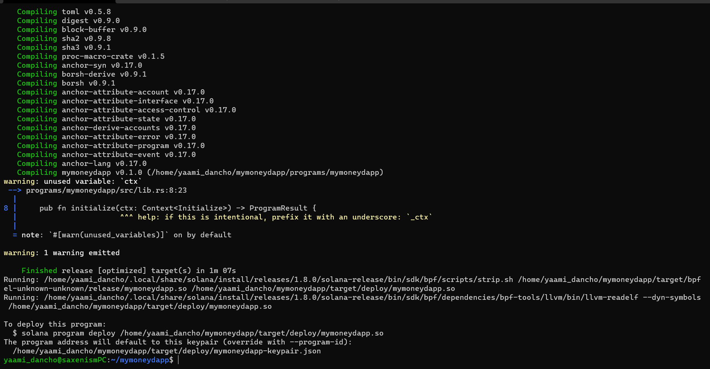

# Building your own crypto-currency using Solana programs

Welcome to the Solana crypto-currency quest. With this quest you'll get upto speed with the most rapidly rising blockchain in the market: *Solana*. It would be awesome if you know a bit 
of Rust (or even C++ concepts) already and are familiar with how blockchains work, but even if you do not have any specific background of Rust or Solana development, we will have all bases covered. If 
you have a high level of interest and motivation, we should be good to go ahead.

In this quest, we will be developing our own crypto-currency on the Solana blockchain or our own `spl-token` in the Solana lingo. This essentially means that once you are done with this quest, 
you will be able to make your crypto-currency using Solana programs and use that to do whatever you can think of, including using it as a fan token, a social token, a governance token, a utility token
or a coin.

# Setting up the Environment: 

There are a few things that we need to get up and running before we move forward in this quest. Before we move forward make sure you've a working NodeJS environment set up. We need rust, Solana, Mocha(a JS testing framework), Anchor and Phantom wallet for this quest.
To install rust, run
```
curl --proto '=https' --tlsv1.2 -sSf https://sh.rustup.rs | sh
source $HOME/.cargo/env
rustup component add rustfmt
```

To install Solana, run
```
sh -c "$(curl -sSfL https://release.solana.com/v1.8.0/install)"
```

To install mocha globally, run
```
npm install -g mocha
```

Now we'll be installing Anchor.
If you're on a linux system, run
```
# Only on linux systems
npm i -g @project-serum/anchor-cli
```

**Fair Warning** : If you are using a Windows system, we highly suggest using [WSL2](https://en.wikipedia.org/wiki/Windows_Subsystem_for_Linux) (Windows sub-system for Linux) or switching to a Linux environment. Setting up WSL is also quick and easy. A 
good walk-through can be found [here](https://www.youtube.com/watch?v=X3bPWl9Z2D0&ab_channel=BeachcastsProgrammingVideos)
For any other OS, you need to build from source. Run the following command
```
cargo install --git https://github.com/project-serum/anchor --tag v0.18.0 anchor-cli --locked
```

To verify that Anchor is installed, run
```
anchor --version
```

Since Solana is still a pretty new blockchain compared to the establised ones out there, it's developer tooling too is pretty limited and cumbersome as of now. However, it is rapidly improving 
and it does so on a daily basis. At the forefront of this development is Anchor, by [Armani Ferrante](https://twitter.com/armaniferrante). You can think of it like the Ruby on Rails framework for
Ruby, that means yes, you can develop things on vanilla Ruby, but Ruby on Rails makes your life much much easier, right? That's the same with Anchor and Solana development. Anchor is the Hardhat of 
Solana development plus much more. It offers a Rust DSL (basically, an easier Rust) to work with along with IDL, CLI and workspace management. Anchor abstracts away a lot of potential security holes
from a conventional Solana 


# Running configurations on Solana CLI

The first command you should run on your terminal (assuming Solana CLI was properly installed in the last quest) is:

```
solana config get
```

This should throw up a result similar to something like: 


If you didnot set up your keypair earlier, then you won't be having the `Keypair Path` in your results. To set that up, follow the instructions over [here](https://docs.solana.com/wallet-guide/paper-wallet#seed-phrase-generation)

We would want to remain on the local network for building our program and later shift to the devent or mainnet-beta if required. If the `RPC URL` field of your last result did not show `localhost`, you can set it to localhost using the following command:

```
solana config set --url localhost
```

Next, we would want to know our account/wallet address and airdrop some SOL tokens into it, to handle all the deployment, transactions etc costs that come with interacting with and using a Solana program. To do that first let's find our address. The command to do that is:
```
solana address
```

This would result into something like this:


Then, for more comprehensive details of your account, use the following command with the address that you got from the last command
```
solana account <your address from the last command>
```

This would result into something like this:


Next, we want to spin up our local network. Think of this local network as a mock Solana blockchain running on your own single system. This network would be required for development and testing of our program. To spin it up, in a separate tab, use the following command:
```
solana-test-validator
```

Once you get an image, like the one below, you know that your local validator (local network) is now up and running


Now, our last task is to top up our account with some SOL, which you can do by using:

```
solana airdrop 100
```

This should result in something like:


# Setting up our Anchor project

In this sub-quest all we would do is initialize an Anchor project and see whether everything's there and working fine or not and after move on ahead to make our own changes.
Head over to your preferred destination for the project using your terminal and then type the following command:
```
anchor init mymoneydapp

cd mymoneydapp
``` 

This would result in a screen somewhat similar to this:


First we check whether we can see the *programs*, *app*, *programs*, *migrations* directory among others or not. If we can, we would head over to *programs/messengerapp/src/lib.rs* to see the default program that Anchor provides us. This is the most basic example possible on Anchor and what's happening here is simply that a user-defined function `Initialize` whenever called would successfully exit the program. That's all, nothing fancy. Now, let's try to compile this program using the following command:

```
anchor build
```

This would trigger a build function and would something like this upon completion:



This build creates a new folder in your project directory called, `target`. This `target` folder contains the `idl` directory, which would also contain the `idl` for our program. The `IDL` or Interface Description Language describes the instructions exposed by the contract and is very similar to ABI in Solidity and user for similar purposes, ie, for tests and front-end integrations. Next, we can move onto testing this program, so that we can get familiar with how testing is done in Anchor. Head to `tests/messengerapp.js`. Here, you'll see a test written in javascript to interact and test the default program. There are a lot of things in the test, that may not make sense to you right now, but stick around and we'll get to those shortly. The test would look something like this:


Next, to actually run these tests, first head over to the tab where you ran the solana-test-validator command and kill that process (using Ctrl-C). Now, use the following command:

```
anchor test
```

The passing tests should result in the following screen:


Now, let's head over to the `programs` directory and start importing some cool Rust crates provided by Anchor which will help us build our money app.

## Importing the Anchor SPL Crates

Head over to `programs/mymoneydapp/Cargo.toml` and under dependencies, add the two following lines:

```
anchor-spl = "0.17.0"
spl-token = { version = "3.1.1", features = ["no-entrypoint"] }
```

Make sure that the version of the `anchor-spl` you write here, matches the version of `anchor-lang` that you had installed. It would be much more convenient for you if install the same version that we are using in the quest. After these changes, the `Cargo.toml` file would look something like this:


Now that we are done adding the dependencies in the Cargo file, let's call it inside our program too. Write down the following `use` statments at the very top of your `programs/mymoneydapp/src/lib.rs` file:

```
use anchor_spl::token::{self, Burn, MintTo, SetAuthority, Transfer};
```

After this, clear all the default code that we were provided with, this would make your coding screen look something like:


## Writing our first program function

Head over to `programs/mymoneydapp/src/lib.rs` and clear the code written there apart from the macro declarations and crates (libraries) that we will be using. After the clearning, your coding screen should look something like the last screen of the last quest.

Now let us simply define four functions that we will be using in our Solana program. The bulk of the program goes in a module under the `#[program]` macro. We'll just define them under the `pub mod mymoneydapp` and write the logic later. These four function definitions would look like this:
```
    pub fn proxy_transfer(ctx: Context<ProxyTransfer>, amount: u64) -> ProgramResult {

    }
    
    pub fn proxy_mint_to(ctx: Context<ProxyMintTo>, amount: u64) -> ProgramResult {
    
    }
    
    pub fn proxy_burn(ctx: Context<ProxyBurn>, amount: u64) -> ProgramResult {
    
    }
    
    pub fn proxy_set_authority(
        ctx: Context<ProxySetAuthority>,
        authority_type: AuthorityType,
        new_authority: Option<Pubkey>,
    ) -> ProgramResult {
    
    }
```

Notice the use of the word `proxy` in each function name? That is because we would be doing `Cross Program Invocation` or CPI for short in this program of ours. This essentially means that we would be calling functions of other Solana programs from our program. As you might have guessed, we would be calling the functions from the `anchor_spl` programs, which is the (abstracted) Anchor implementation of the spl-programs that you can find in the Solana Rust SDK. To look at the structure and explore the `anchor_spl` programs more, visit https://github.com/project-serum/anchor/tree/v0.17.0/spl. Reading through that would also help us understand the *implementations* later on.

Here `pub` means public and `fn` means function, implying that they are public functions that can be invoked from our program, ie it becomes a client-callable program function. The first argument of these functions is always `Context<T>` which consist of the solana accounts array and the program ID, which in essence is the required data to call just about any progarm on Solana. The next parameter of these functions is a `u64` or an unsigned integer named *amount*, which we will be using as our the amount of our tokens in different functions. The `ProgramResult` is the return type of both these functions, which actually is just an easier method to serve function results and/or errors.

As discussed earlier, the `Context` parameter in each function is essentially a list of all the accounts that must be passed for the function to work as expected and the different structs you see in all `Contexts` such as `ProxyTransfer`, `ProxyMintTo`, etc will be defined later. 

After defining the above four functions, your code should look something like this:


## Writing the logic for our functions

The logic of all of our functions would be very straight-forward. We would simply call the functions provided by `anchor_spl` with the correct parameters. That's it. Simple. First update your code as the following:
```
    pub fn proxy_transfer(ctx: Context<ProxyTransfer>, amount: u64) -> ProgramResult {
        token::transfer(ctx.accounts.into(), amount)
    }
    
    pub fn proxy_mint_to(ctx: Context<ProxyMintTo>, amount: u64) -> ProgramResult {
        token::mint_to(ctx.accounts.into(), amount)
    }
    
    pub fn proxy_burn(ctx: Context<ProxyBurn>, amount: u64) -> ProgramResult {
        token::burn(ctx.accounts.into(), amount)
    }
    
    pub fn proxy_set_authority(
        ctx: Context<ProxySetAuthority>,
        authority_type: AuthorityType,
        new_authority: Option<Pubkey>,
    ) -> ProgramResult {
        token::set_authority(ctx.accounts.into(), authority_type.into(), new_authority)
    }
```

With this, your coding screen would look something like: 


If you want to further investigate the functions that we called here, you can head over to the [official docs of the `anchor_spl` crate](https://docs.rs/anchor-spl/0.17.0/anchor_spl/index.html).

## Let's learn to serialize and deserialize

You might already be familiar with the concept of enumerate or `enum` as that is a fairly language agnostic concept. However, if you are not, you can think of enums as a convenient way of naming states or conditions in your code.

Coming to what is serialization and deserialization, the good news is that Anchor does all the heavy lifting in this regards and we just need to know what these terms mean. Simple. So, serialize in general means to put together some data in a standard format and conversely deserealize means to break down a monolith into a standard format of many pieces of data. In terms of Anchor programming, `AccountSerialize` macro is used when a data structure can be serialized and stored into account storage, ie in an `AccountInfo`'s mutable data slice. Similarly, `AccountDeserialize` macro is used when a data structure can be de-serialized from binary format. This macro deserializes the instance from a given slice of bytes and updates the buffer to point at the remaining bytes.

Let's see the above concepts in action. Write the following code outside of the `#[program]` module:
```
#[derive(AnchorSerialize, AnchorDeserialize)]
pub enum AuthorityType {
    MintTokens,
    FreezeAccount,
    AccountOwner,
    CloseAccount
}
```

Since literally everything on the Solana blockchain should be in form of an account, the `derive` macro is used to convert this `enum` in the format of an account. `MintTokens` here would represent the authority to mint new tokens, `FreezeAccount` to freeze accounts associated with the Mint, `AccountOwner` being the owners of a token account and `CloseAccount` representing the authority to close a token account.

After this, your screen would look something like:


### A small note about Accounts on Solana:
An account is not actually a wallet. Instead, it’s a way for the contract to persist data between calls. This includes information such as the count in our base_account, and also information about permissions on the account. Accounts pay rent in the form of lamports, and if it runs out, then the account is purged from the blockchain. Accounts with two years worth of rent attached are “rent-exempt” and can stay on the chain forever.

## Defining our first account struct

In the first function, we used the `ProxyTransfer` struct, right? Now, let's define it so that every relevant information along with the correct constraints on those information (accounts) can be passed to our `proxy_transfer` function. Write the following lines of codes below your `Serialize` and `Deserialize` code:
```
#[derive(Accounts)]
pub struct ProxyTransfer<'info> {
    #[account(signer)]
    pub authority: AccountInfo<'info>,
    #[account(mut)]
    pub from: AccountInfo<'info>,
    #[account(mut)]
    pub to: AccountInfo<'info>,
    pub token_program: AccountInfo<'info>,
}
```

As discussed earlier, everything on Solana is an account, so we convert the `ProxyTransfer` struct (with all the relevant information for the `proxy_transfer` function) into an account using the `derive` account macro in the code above. The account `signer` macro you see is used to enforce the constraint that the authority is the one who signs the transaction (of calling the function) and the account `mut` macro is used to mark an account as mutable, ie, we want to persist changes in those accounts. Now coming onto the accounts themselves, these are a `from` account from which the transfer will take place and the `to` account, to which the tokens will go to. Then the `authority` is the one who should be able to execute these programs and the `token_program` is used to identify which function to call from the original crate.

After this, your code screen should look something like:


### Small note about the Access Control macros
The *Accounts* macro implements the Accounts trait. Transforms a struct from the untrusted &[AccountInfo] slice given to a Solana progam into a validated struct of deserialized account types

#[account]: It is an attribute macro implementing AccountSerialize and AccountDeserialize 

*Account* Wrapper type for a deserialized account implementing AccountDeserialize. Using this type within an *Accounts* struct ensures the account is owned by the address defined by *declare_id!* where the inner account was defined.

With the above (and more Account Constraints and Access Controllers) we can define preconditions for our any instruction handler expecting a certain set of accounts,
allowing us to more easily reason about the security of our programs.


## Defining all other accounts

In a similar fashion to the `ProxyTransfer` account struct, we can define `ProxyMintTo`, `ProxyBurn` and `ProxySetAuthority` structs with the desired information (accounts) in each of them as required by their respective functions. It'll be a fun exercise for you to open up the `anchor-spl` crate in Anchor's github and try to figure out what would be structure of all the remaining account structs. 

Once you have given it your best shot, comapre your structs with what we have here. Up first is the `ProxyMintTo` struct that will be used to call the `proxy_mint_to` function.
```
#[derive(Accounts)]
pub struct ProxyMintTo<'info> {
    #[account(signer)]
    pub authority: AccountInfo<'info>,
    #[account(mut)]
    pub mint: AccountInfo<'info>,
    #[account(mut)]
    pub to: AccountInfo<'info>,
    pub token_program: AccountInfo<'info>,
}
```
This structure is pretty similar to the `ProxyTransfer` struct we defined in the last quest, right? The difference here is with the `Mint` account that is essentially the account of your token, and we would want that to be mutable since you can change supplies and so on. 

Let's tackle the `ProxyBurn` struct next that will be used to call the `proxy_burn` function. That would have a structure similar to this:

```
#[derive(Accounts)]
pub struct ProxyBurn<'info> {
    #[account(signer)]
    pub authority: AccountInfo<'info>,
    #[account(mut)]
    pub mint: AccountInfo<'info>,
    #[account(mut)]
    pub to: AccountInfo<'info>,
    pub token_program: AccountInfo<'info>,
}
```

This structure is again pretty similar to our earlier structs, right? This also requires a `mint` account so that the function could know which `token account` has to be disabled.

With that let's tackle the final account struct, the `ProxySetAuthority` and as you might have guessed, it is slightly different than the rest of the structs:
```
#[derive(Accounts)]
pub struct ProxySetAuthority<'info> {
    #[account(signer)]
    pub current_authority: AccountInfo<'info>,
    #[account(mut)]
    pub account_or_mint: AccountInfo<'info>,
    pub token_program: AccountInfo<'info>,
}
```

The accounts here are used to determine who the current authority is and whether that authority is the one who has signed this transaction or not and whether the new authority of the token account is going to be another account or a mint and then there's the token program again to identify the correct program call.

After defining these accounts, your code screen should look something like this:


## Say hi to Cross Program Invocations (CPIs)

We did briefly talk about Cross Program Invocations, right? We don't really need to get into the details of it and a simple understanding that `CPIs` are used to invoke instructions (functions) on another program. To do so on Anchor is pretty straight-forward since it does a lot of stuff for us under the hood. All we need to is:
1. Create a `CpiContext` object with the target instructin's accounts and program.
2. To perform CPI, just use the `cpi` module
3. Accounts used for CPI are not specifically denoted as such with the `CpiAccount` label since v0.15. Accounts used for CPI are not fundamentally different from `Program` or `Signer` accounts except for their role and ownership in the specific context in which they are used.

So now with the above points in mind, let's create implementation blocks `impl` which we will use to create the `CpiContext`s. We will later use these `CpiContexts` to invoke instructions from other programs. Create `impl` blocks for all account structs and write the following lines of code:

For `ProxyTransfer`
```
impl <'a, 'b, 'c, 'info> From<&mut ProxyTransfer<'info>> 
    for CpiContext<'a, 'b, 'c, 'info, Transfer<'info>>
{

}
```

For `ProxyMintTo`
```
impl<'a, 'b, 'c, 'info> From<&mut ProxyMintTo<'info>>
    for CpiContext<'a, 'b, 'c, 'info, MintTo<'info>>
{

}
```

For `ProxyBurn`
```
impl<'a, 'b, 'c, 'info> From<&mut ProxyBurn<'info>> 
    for CpiContext<'a, 'b, 'c, 'info, Burn<'info>> {

}
```

For `ProxySetAuthority`
```
impl<'a, 'b, 'c, 'info> From<&mut ProxySetAuthority<'info>>
    for CpiContext<'a, 'b, 'c, 'info, SetAuthority<'info>>
{

}
```

After writing all these, your code screen should look something like this:


## Our first CPI

In the last quest we created all the `impl` (implementatuon) blocks for creating the `CpiContexts` that we will now use to call the functions from the other program. 

Now, let me apologise very quickly, since I hadn't been very transparent with you. Remember the strange `into` keyword we used earlier while writing our program functions without any explanation? Well, let me then introduce you to the wonders of the Rust language. The Rust language provides something called the [`From` and `Into` traits](https://doc.rust-lang.org/rust-by-example/conversion/from_into.html) which is essentially a cool way to convert `typeA` **into** `typeB`. Since we know from last quest that we require a `CpiContext` and a list of `CpiAccounts` to perform `CPI` and we also know that the functions that we had written in the very beginning are performing `CPI`, so logically we come to the conclusion that now we must write `from` implementations for those `into` that we used, so that they can be converted into the required format which is `CpiContexts` and `CpiAccounts`.

So, let's see the first implementation of our `from` block that can help convert the parameters of the functions inside of our functions into `CpiContext` and `CpiAccounts`.
Write down the below code: 

```
impl<'a, 'b, 'c, 'info> From<&mut ProxyTransfer<'info>>
    for CpiContext<'a, 'b, 'c, 'info, Transfer<'info>>
{
    fn from(accounts: &mut ProxyTransfer<'info>) -> CpiContext<'a, 'b, 'c, 'info, Transfer<'info>> {
        let cpi_accounts = Transfer {
            from: accounts.from.clone(),
            to: accounts.to.clone(),
            authority: accounts.authority.clone(),
        };
        let cpi_program = accounts.token_program.clone();
        CpiContext::new(cpi_program, cpi_accounts)
    }
}
```

In the above code block we first create a list of our `CpiAccounts` called `cpi_accounts`, then we reference the program that we want to call with the variable name of `cpi_program` and create the new context using `CpiContext::new`. With this implementation our first program `proxy_transfer` is completely ready for doing CPIs.

Writing the above code, your code screen should look something like this:


## Implementing all other `from` blocks

Based on how we wrote the `from` implementation block for `ProxyTransfer`, we can write the `from` implementation blocks for `ProxyMintTo`, `ProxyBurn` and `ProxySetAuthority` in a very similar fashion. A good exercise for you would be to write all these implementations yourselves.

After your best attempt, match your code with the one that is provided below:

For `ProxyMintTo`
```
impl<'a, 'b, 'c, 'info> From<&mut ProxyMintTo<'info>>
    for CpiContext<'a, 'b, 'c, 'info, MintTo<'info>>
{
    fn from(accounts: &mut ProxyMintTo<'info>) -> CpiContext<'a, 'b, 'c, 'info, MintTo<'info>> {
        let cpi_accounts = MintTo {
            mint: accounts.mint.clone(),
            to: accounts.to.clone(),
            authority: accounts.authority.clone(),
        };
        let cpi_program = accounts.token_program.clone();
        CpiContext::new(cpi_program, cpi_accounts)
    }
}
```

For `ProxyBurn`
```
impl<'a, 'b, 'c, 'info> From<&mut ProxyBurn<'info>> for CpiContext<'a, 'b, 'c, 'info, Burn<'info>> {
    fn from(accounts: &mut ProxyBurn<'info>) -> CpiContext<'a, 'b, 'c, 'info, Burn<'info>> {
        let cpi_accounts = Burn {
            mint: accounts.mint.clone(),
            to: accounts.to.clone(),
            authority: accounts.authority.clone(),
        };
        let cpi_program = accounts.token_program.clone();
        CpiContext::new(cpi_program, cpi_accounts)
    }
}
```
For `ProxySetAuthority`
```
impl<'a, 'b, 'c, 'info> From<&mut ProxySetAuthority<'info>>
    for CpiContext<'a, 'b, 'c, 'info, SetAuthority<'info>>
{
    fn from(
        accounts: &mut ProxySetAuthority<'info>,
    ) -> CpiContext<'a, 'b, 'c, 'info, SetAuthority<'info>> {
        let cpi_accounts = SetAuthority {
            account_or_mint: accounts.account_or_mint.clone(),
            current_authority: accounts.current_authority.clone(),
        };
        let cpi_program = accounts.token_program.clone();
        CpiContext::new(cpi_program, cpi_accounts)
    }
}
```
Hope that you fared well with writing your own implementations. Now, all the `proxy` functions that we wrote earlier are ready to work perfectly, except for one fine detail. Since, the implementations are more or less identical we can move onto the next quest, where we figure out the one final piece of this token-program puzzle before it becomes complete.

Now your screen should look something like:


## The last implementation block

Remember the quest where we talked about `enums` and `AccountSerialize` and `AccountDeserialize`? Well, you might be wondering all is good with enums being used to refer to different states with convenient names, but where exactly did we define the states? You are correct, we did not define the states and in this quest we will be doing exactly the same. We will be assigning meaning to the names within enums using the concept of [`impl` for blocks](https://doc.rust-lang.org/std/keyword.impl.html).

Write the below piece of code to implement the `enum` that we defined before defining the different account structs. The below skeleton would be later on filled to `match` the enum with corresponding meaningful values.  

```
impl From<AuthorityType> for spl_token::instruction::AuthorityType {
    fn from(authority_ty: AuthorityType) -> spl_token::instruction::AuthorityType {
    
    }
}
```

This skeleton of the `impl` block is almost the same as previous blocks apart from the difference of `from` vs `for`. right? Good. Now the implementation going inside the block would be different since we are assiging values to a constant (`enum`) and not converting anything into anything. Update the above block with the following code:

```
impl From<AuthorityType> for spl_token::instruction::AuthorityType {
    fn from(authority_ty: AuthorityType) -> spl_token::instruction::AuthorityType {
        match authority_ty {
            AuthorityType::MintTokens => spl_token::instruction::AuthorityType::MintTokens,
            AuthorityType::FreezeAccount => spl_token::instruction::AuthorityType::FreezeAccount,
            AuthorityType::AccountOwner => spl_token::instruction::AuthorityType::AccountOwner,
            AuthorityType::CloseAccount => spl_token::instruction::AuthorityType::CloseAccount,
        }
    }
}
```

The `match` keyword is used in Rust and can be thought of as a sophisticated series of if-else block. Rust provides pattern matching via the `match` keyword, which can be used like a C switch. The first matching arm is evaluated and all possible values must be covered.

With this, your coding part for the Anchor program to create your own crypto-currency comes to an end with your screen looking something like:


## Checking our code

Before writing the tests to interact with our Anchor program, we can make sure that there are no errors in our code, by running the following command:

```
anchor build
```

If the code compiles without any error and gets built, that's good news. Our Anchor program code is working fine and we can move ahead. If you are facing some errors, re-verify that you properly followed all instructions from all the quests. Also, if you are using a different version of `anchor` make sure that there no changes in the newer version for the code that we wrote, if there are revert to `v0.17.0` or update your code accordingly.

Once your program is successfully built, you'll get a screen similar to this:


## Importing the necessary code required for testing our contract

To begin testing, head over to tests/messengerapp.js and delete everything that's written there. We are going to be writing our tests from scratch. The first step would be to import the necessary libraries and constants. To do that, use the following code:

```
const anchor = require("@project-serum/anchor");
const assert = require("assert");
```

Now, since we will be using Mocha for testing our programs, we will create the skeleton of where we will be putting our tests. So, basically, how Mocha works is that it takes describe blocks as testing blocks and within those describe blocks there are numerous tests written using the it blocks. So, use the following code to create the skeleton:

```
describe('mymoneydapp', () => {
  const provider = anchor.Provider.local();
  anchor.setProvider(provider);
  const program = anchor.workspace.TokenProxy;

  let mint = null;
  let from = null;
  let to = null;

  it("Initializes test state", async () => {

  });

  it("Mints a token", async () => {

  });

  it("Transfers a token", async () => {

  });

  it("Burns a token", async () => {

  });

  it("Set new mint authority", async () => {

  });
  
});
```

Now, your screen should look something similar to: 


The additional things that we coded there were the introduction of provider. The provider is the abstraction of a connection to the Solana network. In the test, the Anchor framework will create the provider for us based on the environment (anchor.Provider.local()).

Now, the program is an abstraction that combines the Provider, idl, and the programID (which is generated when the program is built) and allows us to call RPC methods against our program.

Apart from that we have initialized three variables, namely `mint`, `from` and `to` which we will use throughout our testing.

When we have the above things, we can start calling functions in our program, which is what we will be doing in our next sub-quest.

## The SPL Token testing boilerplate

Ideally, while testing this contract, we should have been able to simply use @solana/web3.js to interact with our Anchor program, but it so happens that Anchor is built off a lot of components from Serum and is thus dependent on Serum. What that also means is that, we cannot simply import and use `@solana/web3.js` until `@project-serum/serum` uses the same version of `@solana/web3.js` as anchor.

So, to mimick the functions from `@solana/web3.js`, simply copy and paste the following code. Consider this code as the SPL token client boilerplate for test initialization. Paste this code right below the `describe` block we wrote in the last sub-quest.

```
const serumCmn = require("@project-serum/common");
const TokenInstructions = require("@project-serum/serum").TokenInstructions;

const TOKEN_PROGRAM_ID = new anchor.web3.PublicKey(
  TokenInstructions.TOKEN_PROGRAM_ID.toString()
);

async function getTokenAccount(provider, addr) {
  return await serumCmn.getTokenAccount(provider, addr);
}

async function getMintInfo(provider, mintAddr) {
  return await serumCmn.getMintInfo(provider, mintAddr);
}

async function createMint(provider, authority) {
  if (authority === undefined) {
    authority = provider.wallet.publicKey;
  }
  const mint = anchor.web3.Keypair.generate();
  const instructions = await createMintInstructions(
    provider,
    authority,
    mint.publicKey
  );

  const tx = new anchor.web3.Transaction();
  tx.add(...instructions);

  await provider.send(tx, [mint]);

  return mint.publicKey;
}

async function createMintInstructions(provider, authority, mint) {
  let instructions = [
    anchor.web3.SystemProgram.createAccount({
      fromPubkey: provider.wallet.publicKey,
      newAccountPubkey: mint,
      space: 82,
      lamports: await provider.connection.getMinimumBalanceForRentExemption(82),
      programId: TOKEN_PROGRAM_ID,
    }),
    TokenInstructions.initializeMint({
      mint,
      decimals: 0,
      mintAuthority: authority,
    }),
  ];
  return instructions;
}

async function createTokenAccount(provider, mint, owner) {
  const vault = anchor.web3.Keypair.generate();
  const tx = new anchor.web3.Transaction();
  tx.add(
    ...(await createTokenAccountInstrs(provider, vault.publicKey, mint, owner))
  );
  await provider.send(tx, [vault]);
  return vault.publicKey;
}

async function createTokenAccountInstrs(
  provider,
  newAccountPubkey,
  mint,
  owner,
  lamports
) {
  if (lamports === undefined) {
    lamports = await provider.connection.getMinimumBalanceForRentExemption(165);
  }
  return [
    anchor.web3.SystemProgram.createAccount({
      fromPubkey: provider.wallet.publicKey,
      newAccountPubkey,
      space: 165,
      lamports,
      programId: TOKEN_PROGRAM_ID,
    }),
    TokenInstructions.initializeAccount({
      account: newAccountPubkey,
      mint,
      owner,
    }),
  ];
}
```

With this, your code screen should look something like:


Before moving onto the next quest, notice that we are using two new packages in the above code. You can download them using the following command:

```
npm install @project-serum/common @project-serum/serum
```

Successfull installation shall lead to this kind of screen:


## Initializing the test state

Let us fill in the first `it` block which isn't exactly testing anything, but is essential as it is setting the state of `mint`, the `from` account and the `to` account that will be used throughout all the tests. Let's see how we can set the states in the first `it` block. Update the first `it` block of code as follows:

```
  it("Initializes test state", async () => {
    mint = await createMint(provider);
    from = await createTokenAccount(provider, mint, provider.wallet.publicKey);
    to = await createTokenAccount(provider, mint, provider.wallet.publicKey);
  });
```

With this, your code screen should look something like this:


All the functions used during the initialization have self-explanatory names, however if you want more depth of understanding and more clarity go through the boilerplate code that we copy pasted in the last quest.

## Writing tests for minting and transfering of our token
